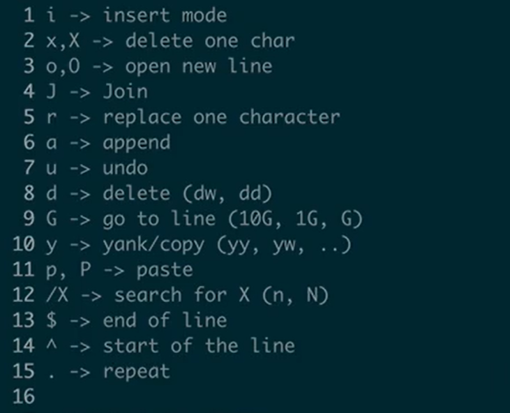
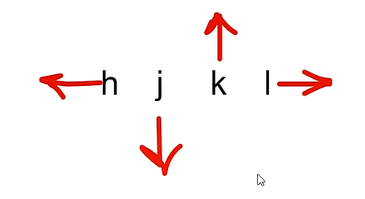
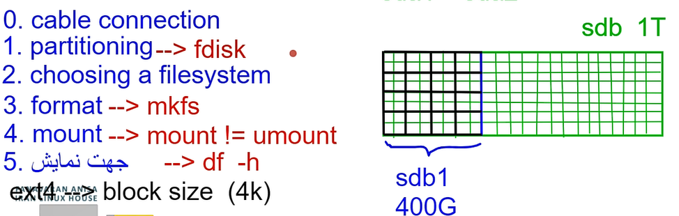
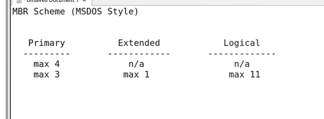
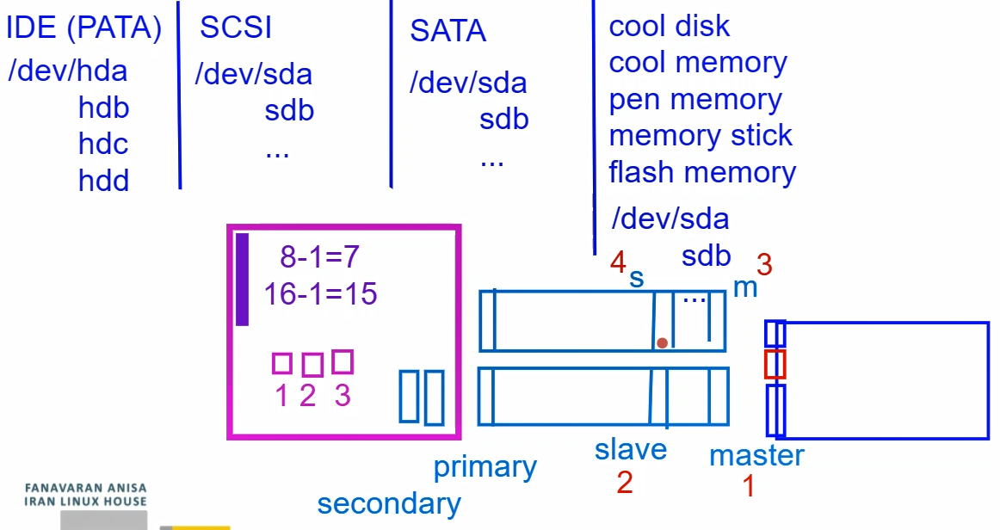

linux gives every file one specifice number : #inode

linux gives every user one specifice number : UID

linux gives every group one specifice number : GID

linux gives every process one specifice number : PID

Text editores in linux:

```
nano,emacs,...

gedit,kedite,xed,pluma,atom,...

vi

vi imporved ---> vim
```

vi has 3 modes :

vi command mode

insert mode (edit mode)

host common mode

Command of vi with explenation:


`i/I/o/O/a/A/r/R` going to insert mode

with esc key you can comeback to first part from insert mode

`:w` saving the file

`:q` quieting from vi


`:set nu ` is setting numder in vi



H is going to first line of the screen

L is going to last line of the screen

gg is going to first line of the file

G is going to last line of the file

w is going one word front

b is going one word backward

^ is going first word of line

0 is going first of line

$ is going last of line

ctrl+f page down

ctrl+b page up

x, X deleting

s deleting one char and going to insert mode

S deleting all of the line and going to insert mode

d + number + direction : cutting

dd cutting all of the line

c doing like d and going to insert mode

y + number + direction : copy

yy copying all of the line

p is pasting right of cercell

P is pasting left of the cercell

serching in vi :

```
/word ---> down
?word ---> up
n going same direction
N going op direction
```

`u` undo

`ctrl+r` redo

`.` last command

save as:

```
:w  address + file name
```

`:n` going next file

`:e + address + file name ` oppening the new file

`:r + address + file name ` adding new scripts to your file

`:q!` quite and not saving (forcing)

`:x` save and quite

`ZZ` save and quite

`:! pwd` go out and doing pwd

`ls -i` showing inode of the file

every partition in disk has its own inode

Mount point : to one directory in logical space (address space) that connected to a partition on physical space.

for example we have two partition in disk (sda1 and sda2) :


command for mounting is `mount` and for unmounting is `umount`



Partisioning Methodes :  
1- MBR(Master boot record) Scheme (MSDOS Style)



2-GPT(Guail partition table) Scheme

ext2 : native / small partition / not journal

ext3 :native / small partition / ext2 + journal

journal : Meta datas of some files in that file for recovery after crash

ext4 : native / look like ext3 but it useable in large partition too

btrfs : advanced file system / 16 EB = 16000 PB = 16,000,000 TB

cross platforms :

vFAT (virtual FAT) = FAT12, FAT16 (2GB), FAT32(4GB), ....

first logical partition start from 5

partition of primary and extended has 4 number maximum


```
:wq  save & exit
:q!  dont save & exit
```
If we have not saved the file and for a new file or... we must: :e! :n! ...

:w! save

Size and File type -------> inode



```
small partition <= 2TB < large partition
```

The file system is:
**"A system for managing the storage and retrieval of data on a disk."**


