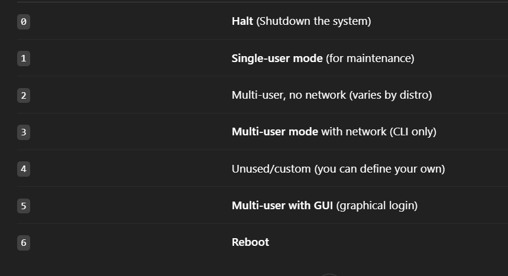

When you are mounting sth to a partition that part or directory is in previous partition and only the blow directories are in the new partitions.

when we unmount sth then we're no longer able to see that inside files\

After adding hard disk to our linux we go to `cd /dev`
and see with `ls -l` that is there sdb in our list or not

partitioning:

1- We use `fdisk` command to begin the partitioning

2- for adding partition we use `n` (for mor help use `m` to see the list)

3- you choose what kind of partition (primary or extended) P or E and the number of your partition

4- You chode from witch sector you want to start
for example from 2048 untill you chooswe the size of it

5- You choose the how much memory you want to have (until 2047 sector is full)

for example +300M

6- you use `w` to write it and save it

ّFormating our partition:

use this line for making a new formating:

```
mkfs -t ext2 /dev/sdb1
```

after making a disk2 file in /mnt/disk2 path you can mount sdb1 in the disk2 :

```
mount dev/sdb1 -t ext2 /mnt/disk2
```

with `history` you can see your command list history

you can unmount it with `unmount /dev/sdb1` or `unmount /mnt/disk2`

after you mount it again you will see your files again
with unmount you just disconnecting the disk2 from your partition!

`df -h` you can see the list of your partition

The address of your mounting is in your hand but standard is under the mnt

`init 0` is turning off  
`init 6` in rebooting

`mkfs.` + Tab(2) you can see which format your system support  
For example`mkfs.ext3 /dev/sdb5`

for the mounting at hard insted of ram :

```
vi /ets/fstab
```

Columns (info):  
1-physical ID (UUID/Label)  
2-mount point address  
3-type of file system  
4-dump backup  
5-file system check

With `mount -a` the partition will be mounting automaticlly

with `mkfs.ext3 -L "backup" /dev/sdb5` you give the backup label to your partition

`df -hT` : with type of system

with `grep + name` you can filter the info (-v : delete)

`fdisk -l` showing the partition

more option like fdisk :
sfdisk, cfdisk, partprobe, gpartx, parted, gparted, ...

```
BIOS vs UEFI vs MBR vs GPT – Summary
BIOS (Basic Input/Output System):
Traditional firmware that starts your PC. Limited features, supports only MBR disks.

UEFI (Unified Extensible Firmware Interface):
Modern replacement for BIOS. Faster, supports Secure Boot, graphical interface, and GPT disks.

MBR (Master Boot Record):
Old partitioning method. Supports up to 4 primary partitions and max 2 TB disk size. Works with BIOS.

GPT (GUID Partition Table):
Newer partitioning method. Supports larger disks (over 2 TB) and many partitions. Required for UEFI.


UEFI + GPT → modern and recommended setup

BIOS + MBR → old and limited

Windows 10/11 needs UEFI + GPT for full support.
```

```
Dump Backup
Purpose: Used to create backups of file systems.

Levels:

0 – Full backup (backs up everything).

1 – Incremental backup (backs up changes since last level 0).

Priority:

Level 0 has the highest priority and is usually done weekly.

Level 1 is done more frequently (e.g., daily) and depends on level 0.

File System Check (fsck)
Purpose: Checks and repairs file system integrity.

Levels (represented as pass numbers in /etc/fstab):

0 – Skip checking.

1 – Check first (usually for the root file system).

2 – Check after level 1 (used for other partitions).

Priority:

1 > 2 > 0

fsck checks level 1 first, then level 2 (in parallel if possible), and skips level 0.
```

```
Tip: Use mount -a to mount all filesystems mentioned in /etc/fstab without rebooting. It saves you from writing multiple mount commands manually and updates df -h output immediately.

```


