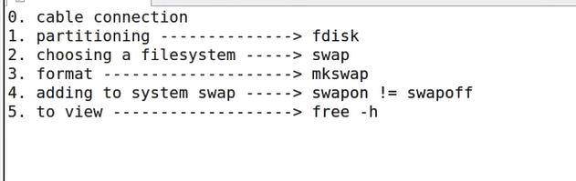
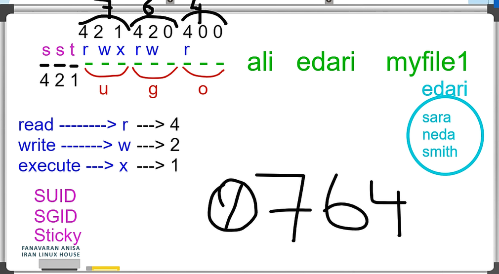
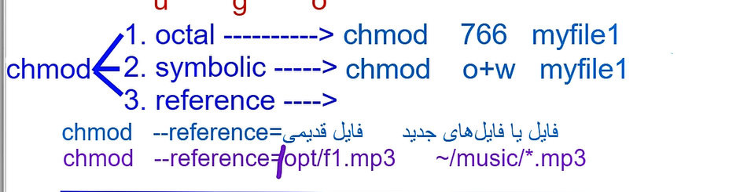

Swap : one partition that it's helper when ram is not enoughan dits a virtual memory (in windows is page file).  
The Least recently used one goes to the swap(LRU)

swap doesn't have mount point!

swap space doesnt have a static space of memory (based on your needs)

if we had LVM we could change the swap space and make it bigger inside our partition

`free -h` you can see the swap space

`lsblk` is to see the partition tree

You can connect the two swao from twwi diffrent memory and connected to each other but the performance is gonna be a little weaker for the kernel!

for swapping instead of `mkfs` we use `mkswap` for formating

in swap we dont have mounting we have adding to system swap with `swapon` anf `swapoff`

For seeing the swap partition use :`free -h`

Steps:


1- make a new partition  
2- change the partition to swap type with `t` adn Hexcode(82 for swap) of partition in fdisk  
3- use `mkswap` and then use `swapon`

With this command you can make swap from another partition :
if : input file  
of : output file  
bs : block size  
The zero file gets the zeroes and puts them into the swap as much as we want

```
dd  if=/dev/zero of=/root/myswap bs=500M count=1
```

Then format it with `mkswap /root/myswap`  
Then add it to our swap file with `swapon /root/myswap`

With catting the /proc you can easily see the swap places : `cat /proc/swaps`

more less partition for swap is better for ourselfs.

`cat /proc/meminfo` gives ram information

`uname -r` version of kernel

To see the sizes of /var and directories all below this: (for example)

```
du -csh /var
```

Permisions of files:
first letter of word is for type of file we dont care!  
we seprate the line every three words:


The logice and most things that we saw in the sites:

more you go the permitions goes less

For root user the things that he can do or what permision that he has is two diffrent things (his power is from somewhere else)

Commands :  
`chmode` is for changing permosions

`chown` is for changing owner (ali)

`chgrp` is for changing the group

`mv` is for changing the file

Type of files:
you can see with command of `file`
c = character special device

The ways to change the chmode :


for changing the directory and below files you give like this :

```
chmod  -R 700 mydir1
```

changing the owner : `chown reza myfile1`

changing the group : `chown  :IT myfile1` (: make change the group)

Or : `chgrp IT myfile1`

both : `chgrp reza:IT myfile1`

for all reza and IT :`chown -R reza:IT mydir1`

For file : `mv + old name + new name`
