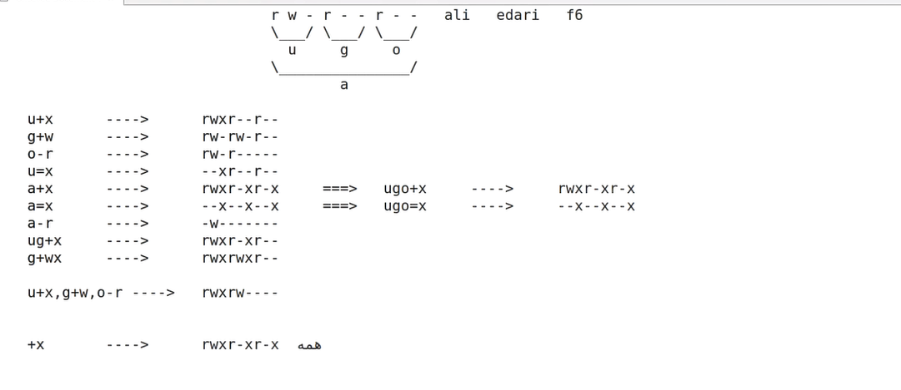
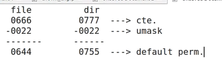

Some example of editing permisions:


With command of `stat + file name ` you can see the file history

For making a group you can use `groupadd` command line

`umask` if you call it show you how much did we reduce the 0666 for files and how much did we reduce from dir 0777 to give the default permisions.


Links:
1- hard link (link)
2- symbolic link (sym link)

To make sym link:

```
ln -s file_asli link_name
```

doesn't have data inside the link.
permision to links of sym link is 777.
we can make a chain link of sym links and if one of them disconnect the chain is broken

If you want to your link work only in a specific way you have to give the link absolute path , o.w. your link goona work in same name in other path!

The sym link is not backup of data and the link is gonnahave a problem if the address changes.

You can use sym links as a shourtcut to the one link with connected files.

For finding things you can use `find` for finding a directory , user, ....  
Examles:

(for the One left to the end normaly `-` is for files but here for filtering with type you have to use `f`).

The command of `-exec + order \;` it meant go do it:

```
-exec rm rf {} \;
```

IF you add `\` to your file name you can make the file name with space:
```
mkdir my\ directory ----> file name: my directory
```

Hard links : 
````
ln fiel_mojod link_name
````
it means a logical name to a physycal file
connected to inode directly.
they must be in one partition.
They are backups. if one of them changes all of them changes.

with `-inum + inode` you can filter inodes with find command


"When we create the user 'farid', a group named 'farid' is automatically created as well, so there is no need to create it manually."

find / -samefile namefile : Searches the entire filesystem (/) to find hard links that point to the same inode as namefile. 

```
find / -samefile namefile -print 2> /dev/null
find / -inum inode -print 2> /dev/null
```
