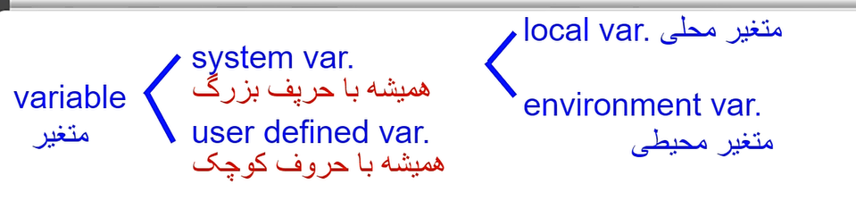
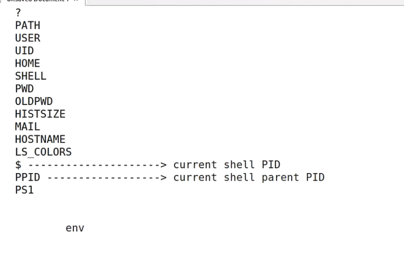
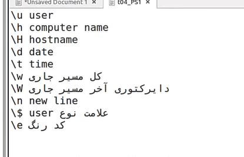
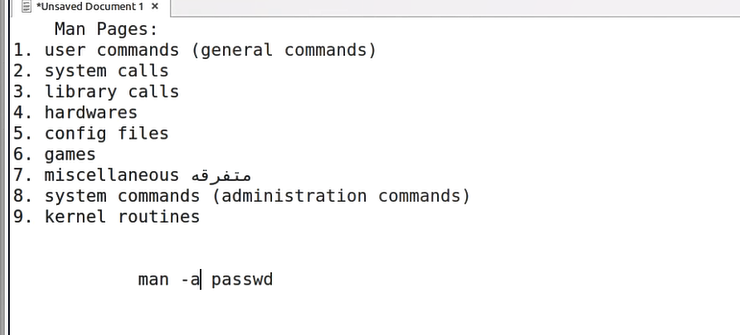
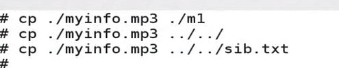

If we use `;` beatween two commands then they are independent from each other
and doing the second command is not related to first one!  
for doing the second command the value of `?` not gonna check

`&&`(ampersand) it means logical 'and', and make two commands dependent to each other that the second one related to first one.  
For doing the second one the value of ? is checking to be 0.

`||`(pipe) it means logical 'or',and make two commands dependent to each other that the second one related to the failiur first one.  
For doing the second one the value of ? is checking to be opposite of 0.

`exit +number` make change of ? value

Variables:

its not important to use captal or not but most people use like this.

you can cd to your var `cd $v2`

`expr` do basic math: `expr 7 + 8`

when you export the var it makes the local var enviroment var.

In `~/.bash_profile` or `~/.bashrc` or `~/.profile` you can define the var permanetly instead of doing it every time in new terminal

Some var for linux:

```
? / PATH / USER / UID / HOME / SHELL / PWD / HISTSIZE / MAIl / HOSTNAME / LS_COLORS/PS1
```



`cd -` is going previous place

with `mail + name` command you can email to someone  
To recieve the email you can just say mail

`ps` show the bash that you've opened,
report the snapshot of current process.

`ps -aux` is for 

`su - ali` is for switching the user more easily

with `PS1` you can change the interface of terminal  
the PS1 changer :


`!5` it means the 5th command in history is gonna run

`!-5`it means the 5th command from bottom

`!!` or `!-1` the last command

`!p` the last command that stareted with p

for deleteing the history `history -d 170`
for deleteing the all of history `history -c`

sqlpluse a command line app for connecting the database of oracl

```
sqlplus username/password@databasename
```

For info:  
`man` or `info` give's us info  
man pages:


`whatis + command ` give you the information in one line about command

`apropos + name` searching for the name and list them to read

`makewhatis` or `mandb` for index

`fdisk --help` last option

`cat etc/passwd` show the user info

Text Processing:

`delimiter  -d "x"` : Separator (x for example)

`cut` is command for seprate the columns

```
cut -d ":" -f 1 etc/passwd
-d -----> delimiter :
-f 1 ---> first field
you can say 1-3 or 1,3 ,...
```

`head` shows from top of the file (default is 10 line)  
for more or less use `-n 3` or `-3`

`tail` is opposite of head, shows from bottom

for saying more than 9 for example use `tail -n +9`

`tail -f 'file name'` or `tailf 'file name'` you can see the live chnages  of file 


`expand` change the tab to space  
 for making more space than usual use :
`expand -t 40` ----> 40 space

`unexpand -a` change all of the spaces to a tab

`od -ta f1`or `od -tc f1`  
 shows whatsinside of f1

`sort`: sorting from A-Z
for the reverse use `-r`  
with `-k` you can sort the columns

```
sort -k 2 -r users.txt
sort -rk 2 useres.txt
sort -nrk 2 useres.txt
```

The `wc` command gives us 3 number:
1- the line number
2- the word number
3- the char number



