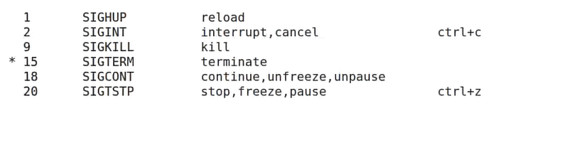
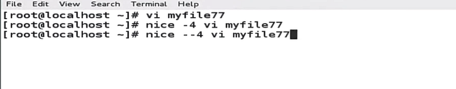
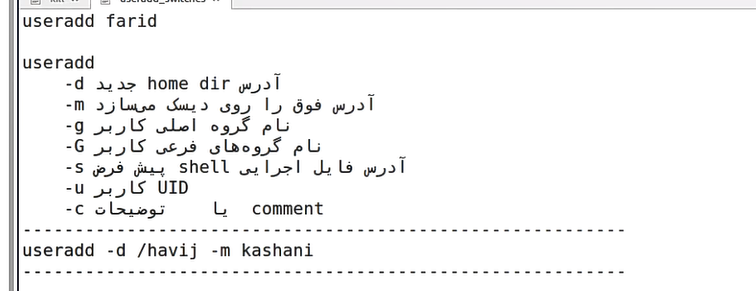

`kill -l` you can see the list of signals fro kill.

The 6 most important signals:


1-SIGHUP: for reloading the new value in memory

2-SIGINT: interrupt and canceling the process

The diffrence beatween 9 and 15 is not that much. the kill process is do it faster and end the process instantly but the terminate wait a little and end the child first and the end the parent process.

The 20 signal is for pausing the process.

For using:

```
kill -15 'PIDnumber'
kill 'PIDnumber'
kill -9 'PID1' 'PID2' ,...
```

the default is 15 signal
The terminate is better than the kill because doesnt let any child be open.

for killing all of one process :

```
killall -15 vi (name of the app)
killall vi
```

`echo $$` shows PID number

Priority:

`ps -el` you can see the priority of the processes.

PR or PRI or NI(nice) . they are the priorities.

we can only change the nice of the system and kernel gonna change the priority from nice.

The normal user can use from 0 up to 19
of nice
if goes up the priority is less important, and if it goes down its more important.

only super user can use negative nices (-20,0)

The normal user cant make a priority more important (onnnnly 0 till 19).

if you want a process with more PR:

-4 is 4 and --4 is -4

fro changing the pr :

```
renice -9 'PIDnumber' ---> changed to -9
```

renice doesnt have - switch

`du -csh` show the disk usage (s=summary, h=human readable, c=total)

`ctrl + z` you can freeze process in the background

`jobs -l` show the background commands

`fg + number` you can make them running again

`bg + number` you can run the commands in background

after they've been running in the background you can use this command to stop (freeze) it again:

```
kill -20 'PID number'
```

`kill -18 'PIDnumber'` you can run them in the background

`&` it means running an its in background
`command &` run it in the background

with `nohup` you can make a running background command even when you log out from system

Some commands can't running in the background , for example ping cant run in the back ground it should be in a file

linux after you maked a user check if there is a user like this name or not? (in /etc/passwd)  
then give the user a new UID.
then make's a new geoup in this name and make a new GID (in /etc/group)
make a new firectory in name user  
gives the permision to the user  
Then copy every file from /etc/skel/\* and set the permision for the files.  
in the /var/spool/mail/.... it make a new file in name of user
...

The hash of passwords is in /etc/shadow

for adding password to the group :

```
gpasswd 'group name'
```

because of active feature shadow you cant see passwd in /etc/group.(its in etc/gshadow)

Adding User:


for changing the user main group or .... use `usermod`

For locking someone you can use `usermod -L`or `passwd -l` and for unlocking someone use `usermod -U` or `passwd -u`

`chsh` is for changing the shell

for making new files for a user the main group is the owner of that file

with `newgrp` you can make a new sub shell and make another group the main one (changin the main group with password of that group)


```
id
```

```
groups
```

```
su - smith
```
