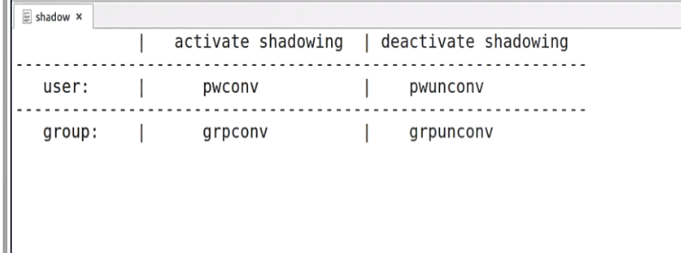
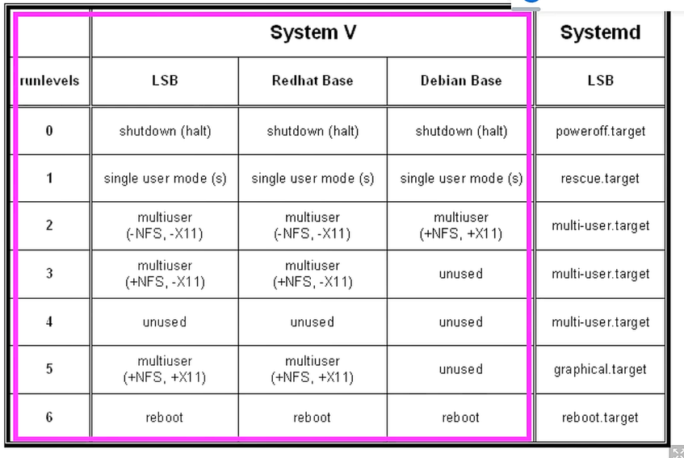
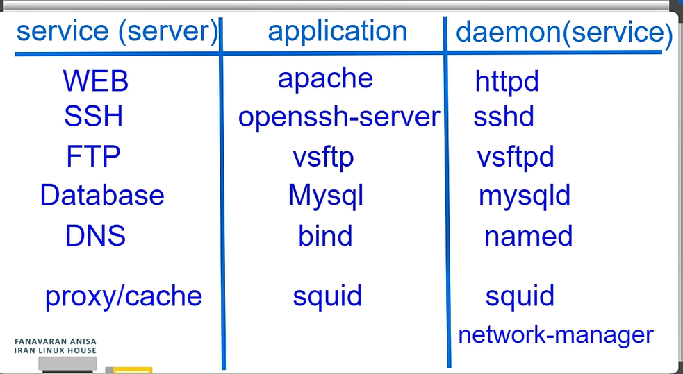

`su - ali` is about loging mode that user logged in at first and `su ali` is about non-login mode so some environmet of last user come here

for changing to root user you can do `sudo su - root` and for ubuntu we cant use root user at first brcause there is no password for root but when you do the `sudo passwd root` you can set the password for root(with sudoers user)

`userdel` is for deleting the user
with `-r` you can delete the directory too

for deleting the group you can use `groupdel` cut befor that you need to change users that this group is their main group

commands for active shadowing:

bootloader: loading the kernel

diffrence beatween reboot and restart is that restart is for one service and came out from memmory but reboot is for all of the system.
restart shut down the power of the system but reboot no!

with `init 'number'` you can change your run level   
run levels:

runlevel command show which run level that you are

with `startx` you can bring a new service up 

web services:
