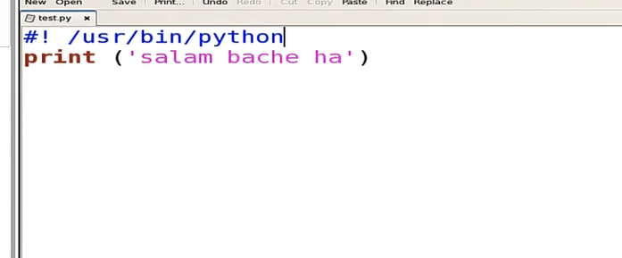
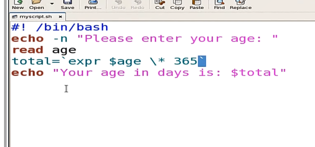
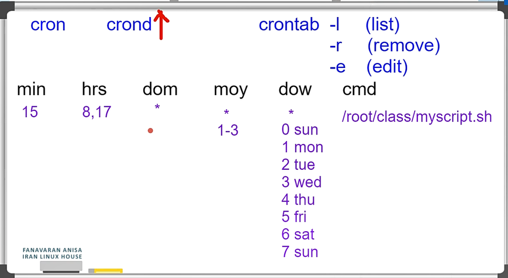
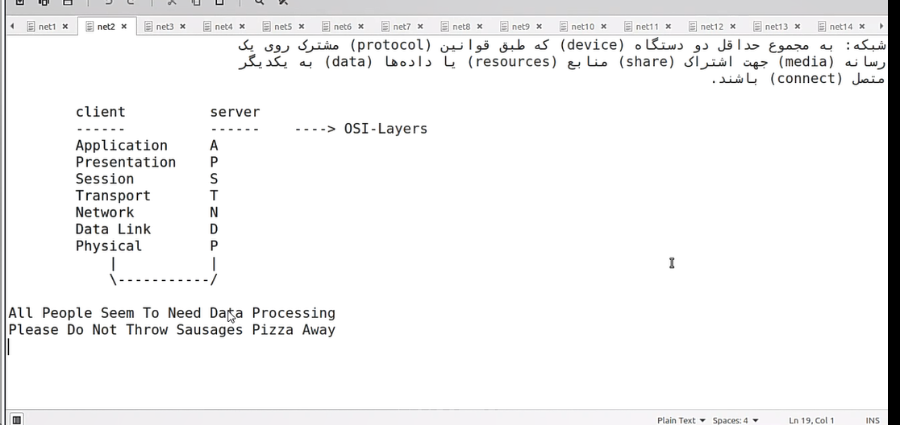
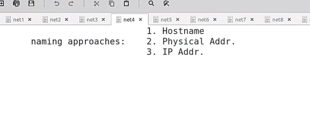
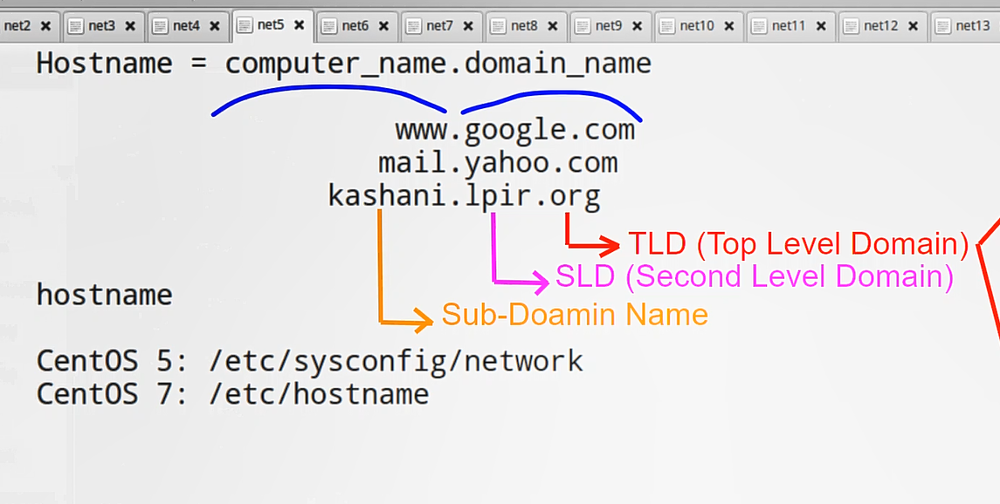
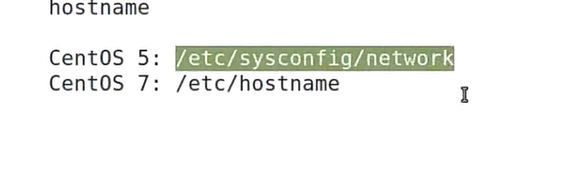
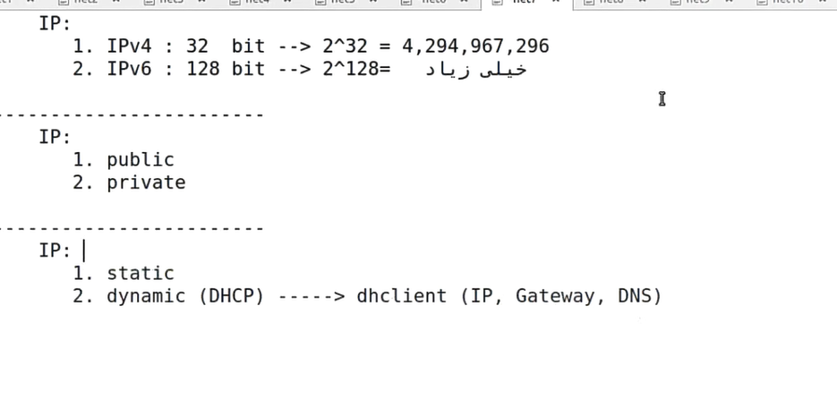
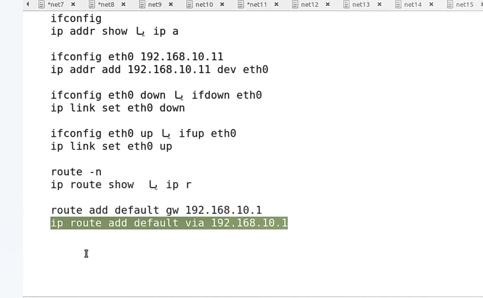
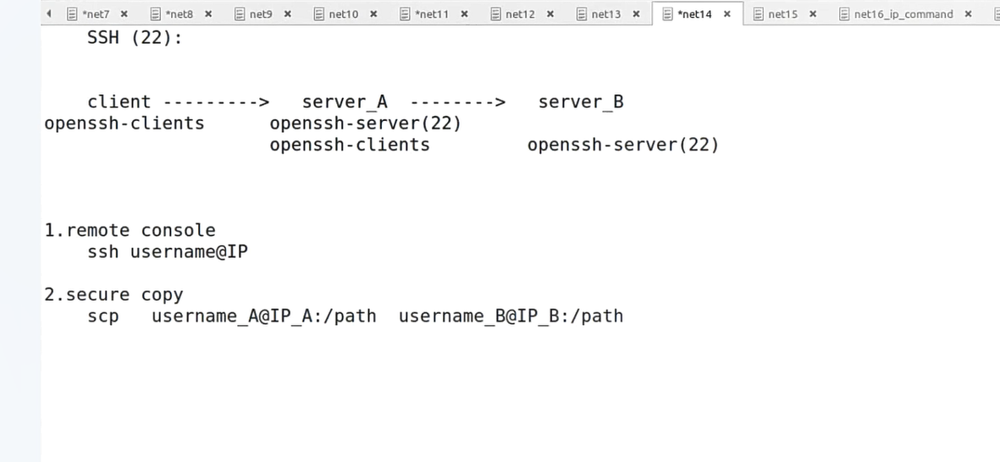

Script is program file and just a text file that you write and inside of it has code which its visible to see.
You write every code in one line with vi.

You call the script file with `bash`:

```
bash "myscript"
```

`gedit` is good for editing the script

shebang line is the first line with `#!` at first of the line and its good for a script

A good script needs x permision, shebang line and `.sh` extention

An example of shebang line :


`expr` do the math for 4 main calculation but you need give the space

`seq` make number beatween the numbers that you give this

-n it means dont go to the next line

`\*` it means multiplicationto next char

you need to use `` for the math line. example:


if command closes with fi at end

do command closes with done at end

For command :


cron service can do the script at the specific time:


Network definition:


The way two or more than two system to call each other: 


com is abboration of commersial.   
org is abboration of orgonazation

hostname :


`hostname` command show your info

you can change the name of your server with this command too 

For permenant changing you can use these paths:(for example for centos)


IP types : 


Default Gateway in linux is changable with route table, you can see the route table with `route -n` commnad and if you want to set a gateway in it you can use `route add default gw "usable IP"`

you can install net-tools package

For the service network stop :
```
ifconfig eth1 down = ifdown eth1 
ifconfig eth1 up  = ifup eth1
```

Some diffrent beatween Ip and config commands : 


The way to connect ssh and copy a file :


```
which top
ls -l /usr/bin/top
```

```
ls -l `which top` = ls -l $(which top)
```
